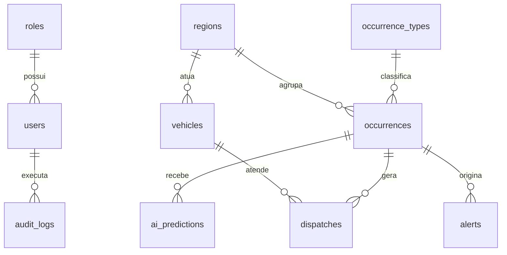

# Modelagem do Banco de Dados - VigIA

## 1. Objetivo da Modelagem

Este documento define a modelagem inicial do banco de dados do projeto VigIA. A estrutura foi pensada para o MVP da plataforma, considerando cadastro de ocorrencias, gerenciamento de viaturas, dashboard operacional, mapa interativo, sugestao de prioridade com apoio de IA, sugestao de viatura e alertas operacionais.

O banco recomendado para o projeto e o PostgreSQL com extensao PostGIS, pois o sistema precisa trabalhar com dados geograficos como latitude, longitude, distancia entre viaturas e ocorrencias, regioes de risco e mapas.

## 2. Entidades Principais

As principais entidades do MVP sao:

- Usuarios.
- Perfis de acesso.
- Tipos de ocorrencia.
- Regioes.
- Ocorrencias.
- Viaturas.
- Despachos.
- Predicoes da IA.
- Alertas operacionais.
- Logs de auditoria.

## 3. Diagrama Logico Simplificado

## 4. Tabelas

## 4.1 roles

Armazena os perfis de acesso do sistema.

| Campo | Tipo | Obrigatorio | Descricao |
|---|---|---|---|
| id | BIGSERIAL PK | Sim | Identificador do perfil. |
| name | VARCHAR(50) | Sim | Nome do perfil. Ex.: administrador, operador, gestor. |
| description | VARCHAR(255) | Nao | Descricao do perfil. |
| created_at | TIMESTAMP | Sim | Data de criacao. |
| updated_at | TIMESTAMP | Sim | Data de atualizacao. |

## 4.2 users

Armazena os usuarios autorizados a acessar o sistema.

| Campo | Tipo | Obrigatorio | Descricao |
|---|---|---|---|
| id | BIGSERIAL PK | Sim | Identificador do usuario. |
| role_id | BIGINT FK | Sim | Perfil do usuario. |
| name | VARCHAR(120) | Sim | Nome do usuario. |
| email | VARCHAR(160) UNIQUE | Sim | E-mail usado para login. |
| password | VARCHAR(255) | Sim | Senha criptografada. |
| active | BOOLEAN | Sim | Indica se o usuario esta ativo. |
| created_at | TIMESTAMP | Sim | Data de criacao. |
| updated_at | TIMESTAMP | Sim | Data de atualizacao. |

## 4.3 occurrence_types

Armazena os tipos de ocorrencia que podem ser registrados.

| Campo | Tipo | Obrigatorio | Descricao |
|---|---|---|---|
| id | BIGSERIAL PK | Sim | Identificador do tipo. |
| name | VARCHAR(100) | Sim | Nome do tipo. Ex.: furto, roubo, violencia domestica. |
| default_severity | SMALLINT | Sim | Gravidade padrao de 1 a 5. |
| active | BOOLEAN | Sim | Indica se o tipo esta ativo. |
| created_at | TIMESTAMP | Sim | Data de criacao. |
| updated_at | TIMESTAMP | Sim | Data de atualizacao. |

## 4.4 regions

Armazena bairros ou regioes operacionais usadas no sistema.

| Campo | Tipo | Obrigatorio | Descricao |
|---|---|---|---|
| id | BIGSERIAL PK | Sim | Identificador da regiao. |
| name | VARCHAR(120) | Sim | Nome do bairro ou regiao. |
| city | VARCHAR(120) | Sim | Cidade da regiao. |
| state | CHAR(2) | Sim | Estado. Ex.: SC. |
| risk_level | SMALLINT | Sim | Nivel de risco simulado de 1 a 5. |
| center_latitude | DECIMAL(10, 7) | Sim | Latitude central da regiao. |
| center_longitude | DECIMAL(10, 7) | Sim | Longitude central da regiao. |
| geom | GEOGRAPHY(POINT, 4326) | Nao | Ponto geografico para calculos com PostGIS. |
| created_at | TIMESTAMP | Sim | Data de criacao. |
| updated_at | TIMESTAMP | Sim | Data de atualizacao. |

## 4.5 occurrences

Armazena as ocorrencias policiais simuladas.

| Campo | Tipo | Obrigatorio | Descricao |
|---|---|---|---|
| id | BIGSERIAL PK | Sim | Identificador da ocorrencia. |
| occurrence_type_id | BIGINT FK | Sim | Tipo da ocorrencia. |
| region_id | BIGINT FK | Sim | Regiao relacionada. |
| code | VARCHAR(30) UNIQUE | Sim | Codigo da ocorrencia. |
| title | VARCHAR(160) | Sim | Titulo resumido da ocorrencia. |
| description | TEXT | Nao | Descricao resumida e ficticia. |
| status | VARCHAR(30) | Sim | Status: aberta, em_atendimento, finalizada, cancelada. |
| informed_severity | SMALLINT | Sim | Gravidade informada de 1 a 5. |
| human_priority | VARCHAR(20) | Nao | Prioridade confirmada pelo operador: baixa, media, alta, critica. |
| ai_priority | VARCHAR(20) | Nao | Prioridade sugerida pela IA. |
| latitude | DECIMAL(10, 7) | Sim | Latitude da ocorrencia. |
| longitude | DECIMAL(10, 7) | Sim | Longitude da ocorrencia. |
| geom | GEOGRAPHY(POINT, 4326) | Nao | Ponto geografico para calculos com PostGIS. |
| occurred_at | TIMESTAMP | Sim | Data e hora da ocorrencia. |
| response_time_minutes | INTEGER | Nao | Tempo de resposta simulado. |
| created_by | BIGINT FK | Nao | Usuario que cadastrou. |
| created_at | TIMESTAMP | Sim | Data de criacao. |
| updated_at | TIMESTAMP | Sim | Data de atualizacao. |

## 4.6 vehicles

Armazena as viaturas disponiveis no ambiente simulado.

| Campo | Tipo | Obrigatorio | Descricao |
|---|---|---|---|
| id | BIGSERIAL PK | Sim | Identificador da viatura. |
| region_id | BIGINT FK | Nao | Regiao principal de atuacao. |
| code | VARCHAR(30) UNIQUE | Sim | Codigo da viatura. |
| team_name | VARCHAR(100) | Nao | Nome ou codigo da equipe. |
| status | VARCHAR(30) | Sim | Status: disponivel, em_atendimento, indisponivel, manutencao. |
| patrol_type | VARCHAR(60) | Nao | Tipo de patrulhamento. |
| latitude | DECIMAL(10, 7) | Sim | Latitude atual simulada. |
| longitude | DECIMAL(10, 7) | Sim | Longitude atual simulada. |
| geom | GEOGRAPHY(POINT, 4326) | Nao | Ponto geografico para calculos com PostGIS. |
| active | BOOLEAN | Sim | Indica se a viatura esta ativa no sistema. |
| created_at | TIMESTAMP | Sim | Data de criacao. |
| updated_at | TIMESTAMP | Sim | Data de atualizacao. |

## 4.7 dispatches

Registra a atribuicao de uma viatura a uma ocorrencia.

| Campo | Tipo | Obrigatorio | Descricao |
|---|---|---|---|
| id | BIGSERIAL PK | Sim | Identificador do despacho. |
| occurrence_id | BIGINT FK | Sim | Ocorrencia atendida. |
| vehicle_id | BIGINT FK | Sim | Viatura atribuida. |
| assigned_by | BIGINT FK | Nao | Usuario que confirmou o despacho. |
| status | VARCHAR(30) | Sim | Status: sugerido, confirmado, recusado, concluido. |
| distance_km | DECIMAL(8, 2) | Nao | Distancia estimada entre viatura e ocorrencia. |
| estimated_arrival_minutes | INTEGER | Nao | Tempo estimado de chegada. |
| assigned_at | TIMESTAMP | Nao | Data e hora da atribuicao. |
| completed_at | TIMESTAMP | Nao | Data e hora de conclusao. |
| created_at | TIMESTAMP | Sim | Data de criacao. |
| updated_at | TIMESTAMP | Sim | Data de atualizacao. |

## 4.8 ai_predictions

Armazena as respostas geradas pelo modulo de IA.

| Campo | Tipo | Obrigatorio | Descricao |
|---|---|---|---|
| id | BIGSERIAL PK | Sim | Identificador da predicao. |
| occurrence_id | BIGINT FK | Sim | Ocorrencia analisada. |
| model_name | VARCHAR(100) | Sim | Nome do modelo ou regra usada. |
| predicted_priority | VARCHAR(20) | Sim | Prioridade sugerida. |
| risk_score | DECIMAL(5, 2) | Sim | Pontuacao de risco de 0 a 100. |
| confidence_score | DECIMAL(5, 2) | Nao | Confianca estimada de 0 a 100. |
| input_summary | JSONB | Nao | Resumo dos dados usados na analise. |
| explanation | TEXT | Nao | Explicacao simples da sugestao. |
| created_at | TIMESTAMP | Sim | Data de criacao. |

## 4.9 alerts

Armazena alertas operacionais gerados pela plataforma.

| Campo | Tipo | Obrigatorio | Descricao |
|---|---|---|---|
| id | BIGSERIAL PK | Sim | Identificador do alerta. |
| occurrence_id | BIGINT FK | Nao | Ocorrencia relacionada ao alerta. |
| type | VARCHAR(60) | Sim | Tipo do alerta. Ex.: padrao_semelhante, area_risco. |
| title | VARCHAR(160) | Sim | Titulo do alerta. |
| description | TEXT | Sim | Descricao do alerta. |
| severity | VARCHAR(20) | Sim | Nivel: baixo, medio, alto, critico. |
| status | VARCHAR(30) | Sim | Status: aberto, visualizado, resolvido. |
| generated_by | VARCHAR(60) | Sim | Origem: sistema, ia, regra. |
| created_at | TIMESTAMP | Sim | Data de criacao. |
| updated_at | TIMESTAMP | Sim | Data de atualizacao. |

## 4.10 audit_logs

Registra acoes importantes realizadas no sistema.

| Campo | Tipo | Obrigatorio | Descricao |
|---|---|---|---|
| id | BIGSERIAL PK | Sim | Identificador do log. |
| user_id | BIGINT FK | Nao | Usuario responsavel pela acao. |
| action | VARCHAR(100) | Sim | Acao realizada. Ex.: occurrence_created. |
| entity_name | VARCHAR(100) | Sim | Nome da entidade afetada. |
| entity_id | BIGINT | Nao | ID do registro afetado. |
| old_values | JSONB | Nao | Valores anteriores. |
| new_values | JSONB | Nao | Valores novos. |
| ip_address | VARCHAR(45) | Nao | IP de origem. |
| created_at | TIMESTAMP | Sim | Data de criacao. |

## 5. Relacionamentos

| Relacionamento | Tipo | Descricao |
|---|---|---|
| roles -> users | 1:N | Um perfil pode estar vinculado a varios usuarios. |
| occurrence_types -> occurrences | 1:N | Um tipo pode classificar varias ocorrencias. |
| regions -> occurrences | 1:N | Uma regiao pode possuir varias ocorrencias. |
| regions -> vehicles | 1:N | Uma regiao pode possuir varias viaturas. |
| occurrences -> dispatches | 1:N | Uma ocorrencia pode ter um ou mais registros de despacho. |
| vehicles -> dispatches | 1:N | Uma viatura pode participar de varios despachos ao longo do tempo. |
| occurrences -> ai_predictions | 1:N | Uma ocorrencia pode receber uma ou mais predicoes. |
| occurrences -> alerts | 1:N | Uma ocorrencia pode estar associada a varios alertas. |
| users -> audit_logs | 1:N | Um usuario pode gerar varios logs. |

## 6. Indices Recomendados

Para melhorar consultas do dashboard, filtros e mapa:

- `occurrences(status)`
- `occurrences(occurred_at)`
- `occurrences(occurrence_type_id)`
- `occurrences(region_id)`
- `occurrences(ai_priority)`
- `vehicles(status)`
- `vehicles(region_id)`
- `alerts(status)`
- `alerts(severity)`
- Indice espacial em `occurrences.geom`
- Indice espacial em `vehicles.geom`
- Indice espacial em `regions.geom`

## 7. Regras de Integridade

- Toda ocorrencia deve ter tipo, regiao, localizacao, data/hora e status.
- Toda viatura deve ter codigo unico.
- Toda ocorrencia deve ter codigo unico.
- Uma ocorrencia so deve receber uma viatura com status `disponivel`.
- Uma viatura em atendimento nao deve ser sugerida para nova ocorrencia.
- Prioridades aceitas: `baixa`, `media`, `alta`, `critica`.
- Status de ocorrencia aceitos: `aberta`, `em_atendimento`, `finalizada`, `cancelada`.
- Status de viatura aceitos: `disponivel`, `em_atendimento`, `indisponivel`, `manutencao`.
- Dados pessoais reais nao devem ser armazenados no banco do MVP.

## 8. Observacoes Sobre LGPD

O banco do MVP deve usar apenas dados simulados. As descricoes das ocorrencias nao devem conter nomes reais, CPF, telefone, endereco completo, placa real, documentos, imagens de pessoas ou qualquer informacao que identifique uma pessoa natural.

Caso o projeto evolua futuramente para dados reais, sera necessario revisar finalidade, base legal, minimizacao de dados, controle de acesso, logs, seguranca, retencao, anonimização e governanca do uso de IA.

## 9. Proximos Passos

1. Validar esta modelagem com os requisitos do MVP.
2. Criar o script SQL inicial em `database/schema.sql`.
3. Criar dados simulados em `database/dados-simulados.csv`.
4. Criar migrations no Laravel com base nesta modelagem.
5. Configurar PostgreSQL e PostGIS no ambiente de desenvolvimento.
